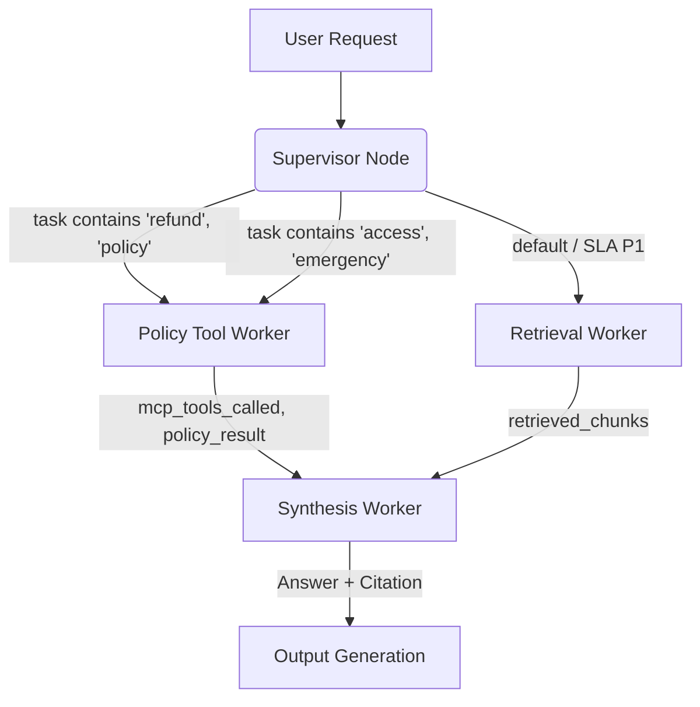

# System Architecture — Lab Day 09

**Nhóm:** Nhóm 10  
**Ngày:** 2026-04-14  
**Version:** 1.0

---

## 1. Tổng quan kiến trúc

**Pattern đã chọn:** Supervisor-Worker  
**Lý do chọn pattern này (thay vì single agent):** Quản lý trạng thái và độ phức tạp tốt hơn khi pipeline có nhiều yêu cầu kết nối với bên ngoài (ví dụ gọi MCP Check Policy) hoặc cần rẽ nhánh chuyên biệt vào Retrieval. Nó giúp hệ thống dễ debug, vì khi lỗi xảy ra, ta biết ngay do bước nào (Routing hay worker retrieval làm sai).

---

## 2. Sơ đồ Pipeline

**Sơ đồ thực tế của nhóm:**

## 3. Vai trò từng thành phần

### Supervisor (`graph.py`)

| Thuộc tính | Mô tả |
|-----------|-------|
| **Nhiệm vụ** | Nhận task và điều phối worker xử lý phù hợp dựa vào từ khóa |
| **Input** | `state["task"]` (Câu hỏi gốc của người dùng) |
| **Output** | `supervisor_route`, `route_reason` |
| **Routing logic** | Sử dụng regex keyword matching (`refund`, `policy`, `access` -> policy_tool_worker; còn lại retrieval) |
| **HITL condition** | Khi cần hỏi xác nhận (chưa cấu hình chi tiết ở bước này) |

### Retrieval Worker (`workers/retrieval.py`)

| Thuộc tính | Mô tả |
|-----------|-------|
| **Nhiệm vụ** | Truy xuất vector DB Chroma để lấy context |
| **Embedding model** | `all-MiniLM-L6-v2` |
| **Top-k** | 3 chunks |
| **Stateless?** | Yes |

### Policy Tool Worker (`workers/policy_tool.py`)

| Thuộc tính | Mô tả |
|-----------|-------|
| **Nhiệm vụ** | Phân tích policy và gọi external tool để xử lý các edge cases |
| **MCP tools gọi** | `search_kb`, `get_ticket_info` |
| **Exception cases xử lý** | Chính sách ngoại lệ như Flash Sale, tài khoản kỹ thuật số |

### Synthesis Worker (`workers/synthesis.py`)

| Thuộc tính | Mô tả |
|-----------|-------|
| **LLM model** | `gpt-4o-mini` |
| **Temperature** | 0.0 (Grounding chặt chẽ) |
| **Grounding strategy** | Chỉ được trả lời bằng evidence cung cấp, không bịa đặt |
| **Abstain condition** | Khi không tìm thấy thông tin |

### MCP Server (`mcp_server.py`)

| Tool | Input | Output |
|------|-------|--------|
| search_kb | query, top_k | chunks, sources |
| get_ticket_info | ticket_id | ticket details |

---

## 4. Shared State Schema

| Field | Type | Mô tả | Ai đọc/ghi |
|-------|------|-------|-----------|
| task | str | Câu hỏi đầu vào | supervisor đọc |
| supervisor_route | str | Worker được chọn | supervisor ghi |
| route_reason | str | Lý do route | supervisor ghi |
| retrieved_chunks | list | Evidence từ retrieval | retrieval ghi, synthesis đọc |
| policy_result | dict | Kết quả kiểm tra policy | policy_tool ghi, synthesis đọc |
| mcp_tools_used | list | Tool calls đã thực hiện | policy_tool ghi |
| final_answer | str | Câu trả lời cuối | synthesis ghi |
| confidence | float | Mức tin cậy | synthesis ghi |

---

## 5. Lý do chọn Supervisor-Worker so với Single Agent (Day 08)

| Tiêu chí | Single Agent (Day 08) | Supervisor-Worker (Day 09) |
|----------|----------------------|--------------------------|
| Debug khi sai | Khó — không rõ lỗi ở đâu | Dễ hơn — test từng worker độc lập |
| Thêm capability mới | Phải sửa toàn prompt | Thêm worker/MCP tool riêng |
| Routing visibility | Không có | Có route_reason trong trace |

**Nhóm điền thêm quan sát từ thực tế lab:**
> Khi gọi Supervisor, ta biết rõ ràng log `route_reason`. Thay vì chỉ biết đáp án của RAG fail, bây giờ có thể khẳng định luôn ví dụ như: do Keyword filter nhảy sai hướng, làm worker này được gọi để tìm policy nhưng thực tế user muốn tìm SLA.

---

## 6. Giới hạn và điểm cần cải tiến

1. Thời gian tạo câu trả lời chậm hơn một lượng nhỏ vì ta phải đi qua Graph orchestration, tốn thêm chi phí overhead so với gọi chain 1 mạch.
2. Từ khóa cố định (Keyword matching) ở Supervisor khá cứng nhắc, dễ sai nếu câu hỏi user có từ đồng nghĩa.
